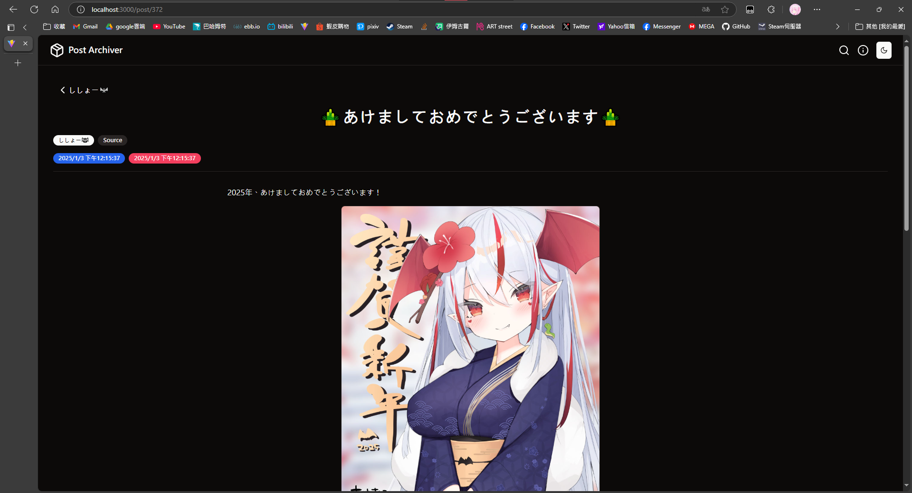

# Post-Archiver-Viewer

To view `Post Archiver`  

## Features
- Random post viewing
- Search posts by authors, tags, collections, etc.
- View summaries.

## Preview
Home Page


Post


## How to Use
1. Download from [Releases](https://github.com/xiao-e-yun/PostArchiverViewer/releases).
2. Unzip and place the executable in the same directory as your `Post Archiver` data folder.
3. Run the executable and open `http://localhost:8000` in your browser.

## Debug or Build
Frontend
```sh
cd frontend;
bun install;
bun run dev;
```
Backend
```sh
# dev profile will proxy 5137 (vite server for HMR)
cargo run
```

## Deploy
```sh
cd frontend;
bun install;
bun run build;
cd ..;
cargo build -r;
```
